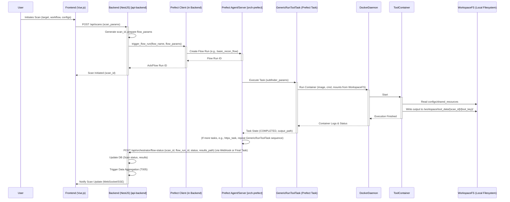

# Siliwangi Sentry - Architecture

This document outlines the system architecture and technical foundations for the Siliwangi Sentry platform. It is based on the concepts detailed in `idea.md`.

## 1. System Diagram (High-Level)

```
[User via CLI/Web UI]
       │
       ▼
┌─────────────────────┐
│  Web Dashboard (UI) │ [frontend-vue]
│  (Vue.js, Tailwind) │
└─────────────────────┘
       │ ▲
       ▼ │ (REST API / WebSockets)
┌─────────────────────┐
│  Platform Backend   │ [backend-nestjs]
│  (NestJS, Node.js)  │
└─────────────────────┘
       │ ▲
       ▼ │ (Task Queue)
┌─────────────────────┐     ┌───────────────────────┐
│ Orchestration Engine│◀───▶│ Workspace Management  │ [orch-engine] / [ws-mgmt]
│ (Prefect/Airflow)   │     │ (Local Filesystem API)│
└─────────────────────┘     └───────────────────────┘
       │
       ▼ (Tool Execution Commands, Docker API)
┌────────────────────────────┐
│ Tool Execution Environment │ [tool-exec-env]
│ (Docker Containers)        │
└────────────────────────────┘
       │ ▲
       ▼ │ (Input: Configs, Wordlists from Workspace)
       │ │ (Output: Raw Tool Data to Workspace)
┌─────────────────────┐
│ FOSS Security Tools │ [foss-tools]
│ (Various Binaries)  │
└─────────────────────┘
       │
       ▼ (Raw Data)
┌────────────────────────────┐
│Data Aggregation/Correlation│ [data-agg-corr]
│ (Backend Logic)            │
└────────────────────────────┘
       │
       ▼ (Normalized Data)
┌─────────────────────┐     ┌─────────────────────┐
│  Database Backend   │     │  Search Backend     │ [db-postgres] / [db-opensearch]
│  (PostgreSQL)       │     │  (OpenSearch)       │
└─────────────────────┘     └─────────────────────┘
```

## 2. Component Descriptions

Refer to `idea.md` Section I for initial component descriptions. This section will be expanded as development progresses.

- **[frontend-vue] Web Dashboard (UI)**: Provides the user interface for interacting with the platform. Built with Vue.js and Tailwind CSS.
- **[backend-nestjs] Platform Backend**: Core API and business logic. Manages user requests, interacts with the orchestration engine, and handles data. Built with NestJS.
- **[orch-engine] Orchestration Engine**: Manages the execution of tools and workflows. Likely Prefect Core or Apache Airflow.
- **[ws-mgmt] Workspace Management**: Handles the defined local workspace for tool configurations, shared resources, tool outputs, and platform logs. See Section 2.1 for detailed structure.
- **[tool-exec-env] Tool Execution Environment**: Runs security tools in isolated Docker containers, with volumes mapped to the workspace.
- **[foss-tools] FOSS Security Tools**: The curated set of security tools (e.g., subfinder, nuclei, nmap).
- **[data-agg-corr] Data Aggregation & Correlation Layer**: Collects, normalizes, and correlates findings from different tools. Primarily managed by the backend.
- **[db-postgres] Database Backend (Relational)**: Stores structured data like assets, scan configurations, and vulnerability metadata (PostgreSQL).
- **[db-opensearch] Database Backend (Search/Analytics)**: Stores logs, aggregated scan results for searching and analytics (OpenSearch).

### 2.1. Workspace (`/workspace`) Detailed Structure [ws-mgmt-detail]

The Siliwangi Sentry platform operates around a central `workspace` directory. This directory is intended to be user-configurable at setup but will have a defined internal structure managed by the platform. All tool inputs (where applicable) are drawn from here, and all outputs are directed here.

```
workspace/
├── tool_configs/         # Configurations for individual tools (e.g., nuclei-config.yaml, zap-policy.xml)
│   ├── nuclei/
│   │   └── config.yaml
│   ├── zap/
│   │   └── default.policy
│   └── general_tool_settings.json # Common settings applicable to multiple tools
├── tool_data/            # Raw and processed outputs from tools, organized by scan/target
│   ├── scan_PROJECTX_TARGETY_TIMESTAMP/
│   │   ├── nuclei_output.json
│   │   ├── nmap_output.xml
│   │   └── aggregated_findings.json
│   └── ...
├── shared_resources/     # Common resources like wordlists, templates, scripts
│   ├── seclists/         # Git submodule or managed copy of SecLists
│   │   └── ...
│   ├── nuclei-templates/ # Git submodule or managed copy of Nuclei Templates
│   │   └── ...
│   └── custom_scripts/   # User-provided scripts that can be invoked by the orchestrator
│       └── myscript.sh
├── reports/              # Generated security reports (PDF, HTML, JSON)
│   ├── PROJECTX_REPORT_TIMESTAMP.pdf
│   └── ...
└── platform_logs/        # Logs for the Siliwangi Sentry platform itself
    ├── backend.log
    ├── orchestrator.log
    └── ui_interactions.log
```

**Key Subdirectories:**

*   **`tool_configs/`**: Stores specific configuration files for security tools. The platform will provide defaults and allow users to manage custom configurations through the UI or by placing files here directly.
    *   A potential `general_tool_settings.json` could hold common parameters like default timeouts, verbosity levels, etc., that can be overridden by specific tool configs.
*   **`tool_data/`**: This is where all raw and processed outputs from security tools are stored. A structured naming convention (e.g., `scan_PROJECT-NAME_TARGET-ID_YYYYMMDDHHMMSS`) will be used for scan-specific subdirectories to keep results organized.
    *   Inside each scan directory, tool outputs will be stored with clear naming (e.g., `subfinder.txt`, `nuclei.json`).
*   **`shared_resources/`**: Contains common resources used by multiple tools.
    *   `seclists/`: A local copy of the SecLists repository (or a subset). See Decision D003 for synchronization.
    *   `nuclei-templates/`: A local copy of the official and custom Nuclei templates. See Decision D003 for synchronization.
    *   `custom_scripts/`: Allows users to add their own scripts that might be integrated into custom scan workflows.
*   **`reports/`**: Destination for final, user-facing reports generated by the platform.
*   **`platform_logs/`**: Contains operational logs for the Siliwangi Sentry components themselves (backend, orchestrator, UI if applicable), aiding in debugging and monitoring the platform's health.

**Interaction Logic:**

*   The **[orch-engine]** will be responsible for mounting relevant parts of the `/workspace` into the **[tool-exec-env]** (Docker containers).
*   Tools will be configured (via wrapper scripts or direct command-line arguments orchestrated by the engine) to read configurations from `/workspace/tool_configs` and `/workspace/shared_resources`, and to write their output to a designated subdirectory within `/workspace/tool_data`.
*   The **[backend-nestjs]** will have an API (internal or potentially user-facing for advanced use) to manage (list, read, potentially trigger updates for) resources in `shared_resources` and `reports`. It will also read `platform_logs` for administrative/monitoring purposes shown in the UI. See Section 2.2 for API endpoint considerations.

### 2.2. Workspace Management API Endpoints (Conceptual) [ws-mgmt-api]

The **[backend-nestjs]** will expose several API endpoints to facilitate interaction with the workspace, primarily for the **[frontend-vue]** and potentially for advanced CLI interactions.

**Resource Management (`/api/workspace/resources`):**

*   `GET /api/workspace/resources/shared/{resource_type}`
    *   Lists items within a shared resource type (e.g., `resource_type` could be `seclists/Wordlists-User-Passwords` or `nuclei-templates/cves`).
    *   Returns: List of files/directories.
*   `POST /api/workspace/resources/shared/{resource_type}/sync` (Relates to D003)
    *   Triggers a synchronization action (e.g., `git pull`) for a manageable shared resource (like `nuclei-templates` or `seclists`).
    *   Returns: Status of the sync operation (e.g., success, failure, logs).

**Tool Configurations (`/api/workspace/tool-configs`):**

*   `GET /api/workspace/tool-configs/{tool_name}`
    *   Lists available configuration profiles for a specific tool (e.g., `tool_name` = `nuclei`).
    *   Returns: List of configuration file names (e.g., `[config.yaml, custom-profile.yaml]`).
*   `GET /api/workspace/tool-configs/{tool_name}/{config_file}`
    *   Retrieves the content of a specific tool configuration file.
    *   Returns: File content (e.g., YAML, JSON).
*   `POST /api/workspace/tool-configs/{tool_name}/{config_file}`
    *   Creates or updates a tool configuration file.
    *   Body: File content.
    *   Returns: Status of the operation.
*   `DELETE /api/workspace/tool-configs/{tool_name}/{config_file}`
    *   Deletes a specific tool configuration file.
    *   Returns: Status of the operation.

**Reports (`/api/workspace/reports`):**

*   `GET /api/workspace/reports`
    *   Lists available generated reports.
    *   Returns: List of report file names and metadata (e.g., creation date, project association).
*   `GET /api/workspace/reports/{report_filename}`
    *   Downloads a specific report file.
    *   Returns: The report file.
*   `DELETE /api/workspace/reports/{report_filename}`
    *   Deletes a specific report.
    *   Returns: Status of operation.

**Platform Logs (`/api/workspace/platform-logs`):**

*   `GET /api/workspace/platform-logs/{log_file_name}`
    *   Retrieves a specific platform log file (e.g., `backend.log`, `orchestrator.log`).
    *   Query params for filtering (e.g., `?lines=100` for last 100 lines).
    *   Returns: Log file content.

**General Workspace (`/api/workspace/browse`):**

*    `GET /api/workspace/browse?path=/shared_resources/custom_scripts`
    *    Provides a generic way to list contents of a given path within the workspace (with appropriate security and path validation to prevent traversal outside defined workspace areas).
    *    Returns: List of files and folders in the specified path.

These endpoints are conceptual and will be refined during the development of the backend API (Task T007). Security considerations (authentication, authorization, input validation, path traversal prevention) will be paramount for these APIs.

## 2.3. Orchestration Engine Design ([orch-engine] - Prefect Core Focus) [orch-design]

As per **Decision D002**, Prefect Core is the chosen orchestration engine. This section outlines its conceptual design and interaction with other platform components.

**Core Responsibilities:**

*   Execute predefined and custom scan workflows (sequences of tool executions).
*   Manage dependencies between tasks within a workflow.
*   Parameterize tool executions using configurations from the workspace (`/workspace/tool_configs/` and `general_tool_settings.json`).
*   Ensure tools read from and write to the correct workspace paths (`/workspace/shared_resources/` for input, `/workspace/tool_data/SCAN_ID/` for output).
*   Report task status (success, failure, logs) back to the main platform (likely via the **[backend-nestjs]** which can then update the database and UI).

**Backend to Orchestrator Communication (Refined):**

1.  **Task Submission**: User initiates a scan via **[frontend-vue]** to **[backend-nestjs]**.
2.  **[backend-nestjs]** prepares scan parameters: unique `scan_id`, `target_info`, `workflow_name` (e.g., `basic_recon_flow`), selected `tool_configurations` (paths to specific files in `/workspace/tool_configs/`), and a copy of relevant sections from `general_tool_settings.json`.
3.  **Triggering Prefect Flow**: The **[backend-nestjs]** will use the `prefect` Python client library (invoked via a child process or a small Python script wrapper if NestJS cannot directly use Python libraries easily) to trigger a specific, deployed Prefect flow run. Alternatively, if a Prefect Server/Cloud instance is used, the backend can make an API request to its `/flow_runs` endpoint.
    *   Example using Prefect Client (conceptual):
        ```python
        # This script might be called by NestJS
        from prefect import flow, get_client
        async def trigger_flow(flow_name: str, parameters: dict):
            async with get_client() as client:
                await client.create_flow_run_from_deployment(
                    deployment_name=f"{flow_name}/default_deployment_name", # Deployment name needs to be predefined
                    parameters=parameters
                )
        ```
    *   The `parameters` dictionary passed to the flow run will contain `scan_id`, `target_info`, `tool_configurations`, `general_settings_snapshot`, etc.

**Prefect Flow Structure (Refined):**

*   **Generic Tool Execution Task (`run_tool_task`)**: This remains a cornerstone.
    *   **Parameters (refined)**: `scan_id: str`, `tool_key: str` (e.g., "subfinder_step1"), `tool_docker_image: str`, `tool_command: str` (actual command string, possibly templated), `workspace_mounts: list[dict]` (e.g., `[{source: '/workspace/shared_resources', target: '/inputs', read_only: True}]`), `tool_config_data: dict` (actual content of specific tool config, if small, or path), `general_settings_snapshot: dict`.
    *   **Logic**: 
        1.  Log received parameters.
        2.  Use a Python Docker client library (e.g., `docker-py`) to manage container lifecycle.
        3.  Dynamically construct volume mounts based on `workspace_mounts` and standard paths like `/workspace/tool_data/{scan_id}/{tool_key}/output` (mounted to `/outputs` in container).
        4.  Pass configurations to the tool: This could involve writing `tool_config_data` to a temporary file within the container's mounted config volume if needed, or passing parameters directly via CLI arguments/environment variables using information from `tool_config_data` and `general_settings_snapshot`.
        5.  Execute container, capture logs (stdout/stderr), and wait for completion.
        6.  Return a dictionary with `status` (`success`/`failure`), `output_path` (`/workspace/tool_data/{scan_id}/{tool_key}/output`), `logs`, and any parsed primary result (e.g., list of subdomains).
    *   Each instance of `run_tool_task` will create/use a dedicated subdirectory under `/workspace/tool_data/{scan_id}/` using its unique `tool_key` for outputs, e.g., `/workspace/tool_data/{scan_id}/subfinder_step1/output/subdomains.txt`.

*   **Workflow-Specific Flows**: These orchestrate `run_tool_task` instances.
    *   They will be responsible for chaining tasks, passing outputs of one task as inputs to another (e.g., by referencing the `output_path` from a previous task and ensuring the next task mounts it appropriately or reads the files directly from the workspace path).

**Incorporating Custom User Scripts (`/workspace/shared_resources/custom_scripts/`):**

*   A specialized version of `run_tool_task` or a new Prefect task (`run_custom_script_task`) could be created.
*   **Parameters**: `scan_id`, `script_path_in_workspace` (e.g., `/workspace/shared_resources/custom_scripts/myscript.sh`), `base_execution_image` (e.g., a generic image with common interpreters like `bash`, `python`, or user-specified), `script_args`.
*   **Logic**: This task would mount the `/workspace/shared_resources/custom_scripts/` directory (or the specific script) into the container and execute it. Outputs would also be directed to `/workspace/tool_data/{scan_id}/custom_script_name/`.
*   Users could define custom flows or modify existing ones (if UI allows) to include these `run_custom_script_task` instances.

**Configuration Management by Orchestrator (Refined):**

*   The **[backend-nestjs]** will pre-process and pass the relevant `general_settings_snapshot` and specific `tool_configurations` (either paths or actual content if small) as parameters to the main Prefect flow.
*   The Prefect `Flow` will then distribute these configurations to individual `run_tool_task` instances as needed.
*   The `run_tool_task` itself will be responsible for applying these: using general settings as defaults and overriding with tool-specific settings, then preparing the tool's execution environment (CLI args, env vars, temporary config files if needed).

**Status Reporting from Prefect to Backend (Refined):**

*   **Prefect Webhooks/Automations**: If using Prefect Server/Cloud, webhooks can be configured on flow run state changes (e.g., COMPLETED, FAILED). These webhooks would call a dedicated API endpoint on the **[backend-nestjs]**.
    *   Endpoint: e.g., `POST /api/orchestrator/flow-status`
    *   Payload: `scan_id`, `flow_run_id`, `status`, `results_summary_path` (link to main output in workspace), error messages if any.
*   **Final Task in Flow**: A final task in every Prefect flow can be responsible for calling the backend API endpoint with the overall status and results.
*   **[backend-nestjs]** upon receiving this status update:
    1.  Updates the `Scans` table in **[db-postgres]**.
    2.  Can trigger the **[data-agg-corr]** layer for further processing of results from `/workspace/tool_data/{scan_id}/`.
    3.  Notifies the user via **[frontend-vue]** (e.g., WebSockets).

**Error Handling (Prefect):**

*   Prefect's built-in retry mechanisms for tasks will be configured.
*   Flows will be designed to handle task failures gracefully, potentially allowing partial results or triggering cleanup tasks.
*   Detailed error information will be passed back to the **[backend-nestjs]** for logging and user notification.

This refined design provides a more detailed plan for implementing T003.

### 2.3.1. Orchestration Sequence Diagram



## 2.4. Tool Execution Environment ([tool-exec-env] - Docker Focus) [tool-exec-design]

This section details the environment in which FOSS security tools are executed, emphasizing Docker containerization as per the overall platform design and `idea.md`.

**Core Principles:**

*   **Isolation**: Each tool (or toolchain part) runs in its own Docker container to prevent conflicts and enhance security.
*   **Reproducibility**: Docker images ensure that tools run in a consistent environment across executions.
*   **Workspace Integration**: Containers will be strictly integrated with the Siliwangi Sentry workspace for inputs (configs, shared resources) and outputs (tool data).
*   **Orchestration-Driven**: Tool execution is managed by the **[orch-engine]** (Prefect Core), specifically through tasks like `GenericRunToolTask`.

**Docker Image Strategy for FOSS Tools:**

1.  **Official Images First**: Where available and well-maintained, official Docker images for security tools will be preferred (e.g., `projectdiscovery/subfinder`, `owasp/zap2docker-stable`). These are typically found on Docker Hub.
2.  **Community Images (with caution)**: If official images are lacking, reputable community-maintained images may be used. These will be vetted for security and maintenance activity.
3.  **Custom-Built Images**: For tools without suitable public images, or if specific customizations/versions are needed, custom Dockerfiles will be created within the Siliwangi Sentry project (e.g., in a dedicated `dockerfiles/tools/` directory, not yet created). These custom images will:
    *   Use minimal base images (e.g., `alpine`, `debian-slim`).
    *   Install only the necessary tool and its dependencies.
    *   Define a clear entrypoint or command.
    *   Be versioned appropriately.
4.  **Base Image for Custom Tools**: A common Siliwangi Sentry base image could be developed (e.g., `siliwangi/tool-base:latest`) containing common dependencies (Python, common shell utilities, etc.) to standardize custom tool image creation.

**Tool Version Management:**

*   **Docker Image Tags**: Specific versions of tools will be managed by using explicit Docker image tags (e.g., `projectdiscovery/subfinder:v2.6.5` instead of `projectdiscovery/subfinder:latest`).
*   **Configuration**: The `tool_docker_image` parameter in the `GenericRunToolTask` (and thus in scan definitions/configurations) will specify the exact image and tag to be used.
*   **Updates**: The platform (via UI/backend) may provide a mechanism to list available tags for known tools and allow users to update the default image tag used in scan policies (see T033 - Tool & Resource Update Mechanisms).

**`GenericRunToolTask` Interaction with Docker Daemon:**

The `GenericRunToolTask` Prefect task, implemented in Python, will use the `docker-py` SDK (or a similar library) to interact with the local Docker daemon. Key interactions include:

*   **`client.images.pull(image_name_with_tag)`**: To ensure the specified tool image is available locally.
*   **`client.containers.run(...)`**: To create and run the tool container. This call will be configured with:
    *   `image`: The `tool_docker_image` (e.g., `projectdiscovery/subfinder:v2.6.5`).
    *   `command`: The `tool_command` to be executed inside the container.
    *   `volumes`: Dynamically constructed based on `workspace_mounts` and standard output paths. For example:
        *   `/workspace/shared_resources/seclists:/inputs/seclists:ro`
        *   `/workspace/tool_configs/nuclei/specific_config.yaml:/app/nuclei_config.yaml:ro`
        *   `/workspace/tool_data/{scan_id}/{tool_key}/output:/outputs:rw`
    *   `environment`: Any necessary environment variables, potentially derived from `tool_config_data` or `general_settings_snapshot`.
    *   `working_dir`: Can be set if tools expect a specific working directory (e.g., `/app/` or `/outputs/`).
    *   `detach=False`: To run the container in the foreground from the task's perspective and wait for it.
    *   `remove=True`: To automatically remove the container when it exits (unless debugging requires otherwise).
    *   `stdout=True, stderr=True`: To capture logs.
*   **Log Handling**: The stdout and stderr streams from `container.logs()` will be captured and stored, typically in `/workspace/platform_logs/tool_executions/{scan_id}_{tool_key}.log` and also returned as part of the task's result for Prefect's logging.
*   **Error Handling**: The task will check the container's exit code. Non-zero exit codes will typically indicate a failed task. Docker client errors (e.g., image not found, daemon unavailable) will also be caught and reported.

**Security Considerations for Tool Execution:**

*   **Principle of Least Privilege**: Containers should run with non-root users where possible (defined in the Docker image).
*   **Resource Limits**: The Docker daemon or container run command can be configured with resource limits (CPU, memory) if necessary, though this might also be a global Docker setting on the user's machine.
*   **Network Isolation**: By default, tool containers should have limited network access unless explicitly required by the tool (e.g., a web scanner needing to reach the target). Docker networking options can be used if fine-grained control is needed, but for a local single-user platform, default bridge networking is often sufficient for tools to reach external targets.

This section will be further refined as specific tools are integrated and their execution requirements become clearer.

## 2.5. Data Aggregation & Correlation Layer ([data-agg-corr]) [data-agg-corr-design]

This layer is responsible for processing the raw outputs from various security tools (stored in `/workspace/tool_data/SCAN_ID/TOOL_KEY/`) and transforming them into a structured, unified format suitable for storage, querying, and presentation on the dashboard. This involves parsing diverse tool outputs, defining a common data model, storing data in PostgreSQL for relational integrity, and indexing it in OpenSearch for advanced search and analytics.

**Core Processes:**

1.  **Output Collection**: Triggered after a Prefect flow (scan) completes, or after individual critical tool tasks.
2.  **Parsing**: Convert raw tool output (JSON, XML, CSV, plain text) into a structured Python/TypeScript object representation.
3.  **Normalization & Enrichment**: Map tool-specific fields to a Common Data Model (CDM). Enrich data (e.g., adding asset information, scan context, CVSS scores if not directly provided but calculable).
4.  **Correlation & Deduplication**: Identify unique assets and vulnerabilities, merging findings from different tools related to the same entity.
5.  **Storage**: Load structured data into PostgreSQL.
6.  **Indexing**: Prepare and send data to OpenSearch for indexing.

**Tool Output Parsing:**

*   **Strategy**: For each integrated tool, a dedicated parser module/function will be developed within the **[backend-nestjs]** or as a separate Python utility callable by the backend/orchestrator.
*   **Input**: Path to the tool's output file(s) in `/workspace/tool_data/SCAN_ID/TOOL_KEY/`.
*   **Output**: A list of objects conforming to the Common Data Model (see below).
*   **Libraries**: Utilize existing libraries for common formats (e.g., `xml2js` or `fast-xml-parser` for XML, standard JSON parsers, CSV parsers). Custom regex or line-by-line parsing for plain text outputs.
*   **Error Handling**: Parsers must gracefully handle malformed or unexpected output, logging errors without crashing the aggregation process.

### 2.5.3 Common Data Model (CDM) - Preliminary

The CDM will provide a standardized way to represent security data collected from various tools. This allows for consistent processing, storage, and analysis.

**Core Entities:**

1.  **`Asset`**: Represents any discoverable target or piece of infrastructure.
    *   `asset_id` (Primary Key, UUID)
    *   `type` (Enum: `DOMAIN`, `IP_ADDRESS`, `URL`, `CIDR`, `DEVICE`, `SERVICE`, `CODE_REPOSITORY`, `CLOUD_RESOURCE`, etc.)
    *   `value` (String, e.g., "example.com", "192.168.1.1")
    *   `tags` (Array of Strings, e.g., ["production", "external"])
    *   `source` (String, tool or process that identified the asset, e.g., "Subfinder", "Manual")
    *   `first_seen` (Timestamp)
    *   `last_seen` (Timestamp)
    *   `attributes` (JSONB, for tool-specific or type-specific details like open ports, resolved IPs for a domain, technology stack, etc.)
    *   `workspace_id` (Foreign Key to Workspace)

2.  **`Finding`** (formerly `Finding/Vulnerability`): Represents a specific security issue, weakness, or piece of information identified by a tool.
    *   `finding_id` (Primary Key, UUID)
    *   `asset_id` (Foreign Key to `Asset`, can be NULL if finding is not asset-specific)
    *   `tool_run_id` (Foreign Key to `ToolRun`)
    *   `type` (Enum: `VULNERABILITY`, `MISCONFIGURATION`, `INFORMATION`, `SECRET`, `EXPOSED_SERVICE`, etc.)
    *   `title` (String, concise description, e.g., "SQL Injection in login.php")
    *   `description` (Text, detailed explanation of the finding)
    *   `severity` (Enum: `CRITICAL`, `HIGH`, `MEDIUM`, `LOW`, `INFORMATIONAL`)
    *   `status` (Enum: `OPEN`, `CLOSED`, `ACCEPTED_RISK`, `FALSE_POSITIVE`, `REMEDIATED`)
    *   `confidence` (Enum: `HIGH`, `MEDIUM`, `LOW`, `CONFIRMED`)
    *   `cwe_id` (Integer, Common Weakness Enumeration ID, if applicable)
    *   `cve_id` (String, Common Vulnerabilities and Exposures ID, if applicable)
    *   `cvss_score` (Float, if applicable)
    *   `cvss_vector` (String, if applicable)
    *   `remediation_guidance` (Text)
    *   `evidence` (JSONB, e.g., vulnerable URL, request/response, code snippet, log entry)
    *   `tags` (Array of Strings)
    *   `first_seen` (Timestamp)
    *   `last_seen` (Timestamp)
    *   `reported_at` (Timestamp, when the tool reported it)
    *   `additional_properties` (JSONB, for tool-specific details not fitting other fields)
    *   `workspace_id` (Foreign Key to Workspace)

3.  **`ScanMetadata`**: Information about a specific scan execution or workflow instance.
    *   `scan_id` (Primary Key, UUID)
    *   `scan_name` (String, user-defined or generated name for the scan)
    *   `scan_type` (Enum: `RECON`, `VULN_SCAN`, `FULL_PENTEST_WORKFLOW`, `CUSTOM`)
    *   `trigger_type` (Enum: `MANUAL`, `SCHEDULED`, `API`)
    *   `status` (Enum: `PENDING`, `RUNNING`, `COMPLETED`, `FAILED`, `CANCELLED`)
    *   `start_time` (Timestamp)
    *   `end_time` (Timestamp, nullable)
    *   `parameters` (JSONB, input parameters for the scan/workflow)
    *   `user_id` (Foreign Key to User, if applicable, for user who initiated scan)
    *   `workspace_id` (Foreign Key to Workspace)
    *   `description` (Text, optional description of the scan's purpose or scope)

4.  **`ToolRun`**: Information about a single tool execution within a scan.
    *   `tool_run_id` (Primary Key, UUID)
    *   `scan_id` (Foreign Key to `ScanMetadata`)
    *   `tool_name` (String, e.g., "Nuclei", "Nmap")
    *   `tool_version` (String, e.g., "2.9.3")
    *   `docker_image` (String, e.g., "projectdiscovery/nuclei:latest")
    *   `command_line` (Text, the exact command executed)
    *   `parameters` (JSONB, parameters specific to this tool run)
    *   `status` (Enum: `PENDING`, `RUNNING`, `COMPLETED`, `FAILED`, `TIMED_OUT`)
    *   `start_time` (Timestamp)
    *   `end_time` (Timestamp, nullable)
    *   `log_path` (String, path to the tool's raw output log in the workspace, if applicable)
    *   `configuration` (JSONB, tool configuration used for this run)
    *   `workspace_id` (Foreign Key to Workspace)

**Relationships (Conceptual):**

*   A `Workspace` has many `Asset`s, `Finding`s, `ScanMetadata` entries, and `ToolRun`s.
*   A `ScanMetadata` can have many `ToolRun`s (representing a workflow of tools).
*   A `ToolRun` can produce many `Finding`s.
*   A `Finding` is typically associated with one `Asset` (though some findings might be global or relate to multiple assets indirectly).
*   An `Asset` can have many `Finding`s.

This CDM will be refined further as specific tool integrations and data processing needs are explored.

### 2.5.4 PostgreSQL Schema Planning

The PostgreSQL database will serve as the primary relational store for structured security data. The schema will be derived directly from the Common Data Model (CDM).

**Tables:**

1.  **`workspaces`** (If not already implicitly handled by tenancy in a multi-user setup. For now, assuming a single conceptual workspace or a `workspace_id` in each table as defined in CDM)
    *   `workspace_id` (UUID, Primary Key)
    *   `name` (VARCHAR(255), Unique)
    *   `description` (TEXT)
    *   `created_at` (TIMESTAMPTZ, Default: `NOW()`)
    *   `updated_at` (TIMESTAMPTZ, Default: `NOW()`)

2.  **`assets`**
    *   `asset_id` (UUID, Primary Key)
    *   `workspace_id` (UUID, Foreign Key references `workspaces(workspace_id)` ON DELETE CASCADE) 
    *   `type` (VARCHAR(50), Not Null) *Initially as VARCHAR, consider ENUM type later*
    *   `value` (TEXT, Not Null)
    *   `tags` (TEXT[], Nullable)
    *   `source` (VARCHAR(255), Nullable)
    *   `first_seen` (TIMESTAMPTZ, Not Null, Default: `NOW()`)
    *   `last_seen` (TIMESTAMPTZ, Not Null, Default: `NOW()`)
    *   `attributes` (JSONB, Nullable)
    *   *Index on: `(workspace_id, type, value)` (Unique), `tags` (GIN), `source`*

3.  **`findings`**
    *   `finding_id` (UUID, Primary Key)
    *   `workspace_id` (UUID, Foreign Key references `workspaces(workspace_id)` ON DELETE CASCADE)
    *   `asset_id` (UUID, Nullable, Foreign Key references `assets(asset_id)` ON DELETE SET NULL)
    *   `tool_run_id` (UUID, Not Null, Foreign Key references `tool_runs(tool_run_id)` ON DELETE CASCADE)
    *   `type` (VARCHAR(50), Not Null) *Consider ENUM type later*
    *   `title` (TEXT, Not Null)
    *   `description` (TEXT, Nullable)
    *   `severity` (VARCHAR(20), Not Null) *Consider ENUM type later*
    *   `status` (VARCHAR(30), Not Null, Default: 'OPEN') *Consider ENUM type later*
    *   `confidence` (VARCHAR(20), Nullable) *Consider ENUM type later*
    *   `cwe_id` (INTEGER, Nullable)
    *   `cve_id` (VARCHAR(30), Nullable)
    *   `cvss_score` (DECIMAL(3,1), Nullable)
    *   `cvss_vector` (VARCHAR(100), Nullable)
    *   `remediation_guidance` (TEXT, Nullable)
    *   `evidence` (JSONB, Nullable)
    *   `tags` (TEXT[], Nullable)
    *   `first_seen` (TIMESTAMPTZ, Not Null, Default: `NOW()`)
    *   `last_seen` (TIMESTAMPTZ, Not Null, Default: `NOW()`)
    *   `reported_at` (TIMESTAMPTZ, Not Null, Default: `NOW()`)
    *   `additional_properties` (JSONB, Nullable)
    *   *Index on: `(workspace_id, asset_id)`, `tool_run_id`, `type`, `severity`, `status`, `cve_id`, `cwe_id`, `tags` (GIN)*

4.  **`scans_metadata`**
    *   `scan_id` (UUID, Primary Key)
    *   `workspace_id` (UUID, Foreign Key references `workspaces(workspace_id)` ON DELETE CASCADE)
    *   `scan_name` (VARCHAR(255), Nullable)
    *   `scan_type` (VARCHAR(50), Not Null) *Consider ENUM type later*
    *   `trigger_type` (VARCHAR(30), Not Null) *Consider ENUM type later*
    *   `status` (VARCHAR(30), Not Null, Default: 'PENDING') *Consider ENUM type later*
    *   `start_time` (TIMESTAMPTZ, Nullable, Default: `NOW()`)
    *   `end_time` (TIMESTAMPTZ, Nullable)
    *   `parameters` (JSONB, Nullable)
    *   `user_id` (UUID, Nullable) *Assuming a `users` table exists or will exist*
    *   `description` (TEXT, Nullable)
    *   *Index on: `(workspace_id, status)`, `scan_type`, `trigger_type`, `user_id`*

5.  **`tool_runs`**
    *   `tool_run_id` (UUID, Primary Key)
    *   `workspace_id` (UUID, Foreign Key references `workspaces(workspace_id)` ON DELETE CASCADE)
    *   `scan_id` (UUID, Not Null, Foreign Key references `scans_metadata(scan_id)` ON DELETE CASCADE)
    *   `tool_name` (VARCHAR(100), Not Null)
    *   `tool_version` (VARCHAR(50), Nullable)
    *   `docker_image` (VARCHAR(255), Nullable)
    *   `command_line` (TEXT, Nullable)
    *   `parameters` (JSONB, Nullable)
    *   `status` (VARCHAR(30), Not Null, Default: 'PENDING') *Consider ENUM type later*
    *   `start_time` (TIMESTAMPTZ, Nullable, Default: `NOW()`)
    *   `end_time` (TIMESTAMPTZ, Nullable)
    *   `log_path` (TEXT, Nullable)
    *   `configuration` (JSONB, Nullable)
    *   *Index on: `(workspace_id, scan_id)`, `tool_name`, `status`*

**General Notes on Schema:**

*   **UUIDs**: Using UUIDs for primary keys to allow for distributed ID generation if needed in the future.
*   **Timestamps**: Using `TIMESTAMPTZ` (timestamp with time zone) for all temporal data.
*   **ENUM Types**: For fields like `type`, `severity`, `status` in various tables, PostgreSQL `ENUM` types should be created for data integrity and efficiency. This is noted as a later refinement.
*   **JSONB**: Using `JSONB` for flexible storage of attributes, evidence, and parameters.
*   **Indexing**: Initial indexing strategy is outlined. This will need to be reviewed and optimized based on common query patterns.
*   **Foreign Keys**: `ON DELETE CASCADE` or `ON DELETE SET NULL` are used as appropriate to maintain referential integrity. For example, deleting a `scan_metadata` entry will also delete its associated `tool_runs` and `findings`. Deleting an `asset` will set `asset_id` to NULL in `findings` if a finding can exist without an asset.
*   **ORM**: The NestJS backend (T007) will utilize an ORM (e.g., TypeORM or Prisma) which will help manage schema migrations and interactions with the database. The ORM entities will directly map to these tables.
*   A `users` table is assumed for `user_id` foreign keys. This would be part of the authentication/authorization module.

This schema provides a solid foundation. It will evolve as the platform is developed, particularly when implementing specific tool integrations and reporting features.

### 2.5.5 OpenSearch Indexing Strategy

OpenSearch will be used for advanced searching, analytics, and visualization of findings and related data. The primary goal is to provide fast and flexible querying capabilities that might be less performant or more complex with a purely relational database.

**1. Primary Index: `siliwangi_findings`**

*   **Purpose**: This will be the main, denormalized index for all `Finding` documents. It will embed relevant information from `Asset`, `ToolRun`, and `ScanMetadata` to facilitate rich, context-aware searches without requiring joins at query time.
*   **Document Structure (Example for a single finding):**
    ```json
    {
      "finding_id": "uuid-for-finding",
      "workspace_id": "uuid-for-workspace",
      "title": "SQL Injection in login.php",
      "description": "Detailed explanation of the SQL injection vulnerability...",
      "type": "VULNERABILITY",
      "severity": "HIGH",
      "status": "OPEN",
      "confidence": "CONFIRMED",
      "cwe_id": 89,
      "cve_id": "CVE-2023-XXXX",
      "cvss_score": 7.5,
      "cvss_vector": "CVSS:3.1/AV:N/AC:L/PR:N/UI:N/S:U/C:H/I:N/A:N",
      "remediation_guidance": "Use parameterized queries...",
      "evidence_summary": "Vulnerable URL: /login.php?id=1 OR 1=1", // Could be a snippet or reference
      "tags": ["web", "sqli", "production"],
      "first_seen": "timestamp",
      "last_seen": "timestamp",
      "reported_at": "timestamp",
      "additional_properties": { "tool_specific_key": "value" },
      "asset": {
        "asset_id": "uuid-for-asset",
        "type": "URL",
        "value": "http://example.com/login.php",
        "tags": ["production", "external"],
        "attributes": { "ip_address": "192.168.1.10" }
      },
      "tool_run": {
        "tool_run_id": "uuid-for-tool-run",
        "tool_name": "SQLMap",
        "tool_version": "1.7.6",
        "command_line": "sqlmap -u http://example.com/login.php?id=1 --batch"
      },
      "scan": {
        "scan_id": "uuid-for-scan",
        "scan_name": "Weekly Web Scan",
        "scan_type": "VULN_SCAN"
      }
    }
    ```

**2. Data Preparation and Ingestion:**

*   The **[backend-nestjs]** service will be responsible for preparing these denormalized JSON documents.
*   When a new `Finding` is created or updated in PostgreSQL (likely after tool output parsing and initial storage), the backend will construct the corresponding OpenSearch document by fetching related `Asset`, `ToolRun`, and `ScanMetadata` information.
*   This process can occur asynchronously to avoid blocking the main application flow.
*   Updates to related entities (e.g., an `Asset`'s tags change, or a `Finding`'s status is updated) should trigger an update to the corresponding document(s) in OpenSearch to maintain consistency.

**3. Index Mappings (`siliwangi_findings`):**

Explicit mappings are crucial for performance and search accuracy. Key considerations:

*   **`finding_id`, `asset_id`, etc.**: `keyword` type for exact matches and aggregations.
*   **`title`, `description`, `remediation_guidance`**: `text` type with appropriate analyzers (e.g., standard analyzer for full-text search, potentially a keyword analyzer for exact phrases if needed).
*   **`type`, `severity`, `status`, `confidence`, `asset.type`, `tool_run.tool_name`**: `keyword` type for filtering and aggregation.
*   **`cwe_id`**: `integer`.
*   **`cve_id`**: `keyword`.
*   **`cvss_score`**: `float`.
*   **`tags`, `asset.tags`**: `keyword` type (OpenSearch handles arrays of keywords well).
*   **Timestamps (`first_seen`, `last_seen`, `reported_at`)**: `date` type.
*   **Nested Objects (`asset`, `tool_run`, `scan`)**: `object` type, with their fields mapped appropriately (e.g., `asset.value` as `keyword` or `text` depending on search needs).
*   **`additional_properties`, `asset.attributes`, `evidence_summary` (if JSON)**: `object` or `flattened` type if the structure is highly dynamic and not all sub-fields need to be individually queried. For `evidence_summary` as text, it would be `text`.
*   **Dynamic Mapping**: While explicit mapping is preferred, dynamic mapping can be enabled or configured with templates for fields within `additional_properties` or `asset.attributes` if they are truly unpredictable, but with caution to avoid mapping explosions.

**Example Partial Mapping:**
```json
{
  "mappings": {
    "properties": {
      "finding_id": { "type": "keyword" },
      "title": { "type": "text" },
      "description": { "type": "text" },
      "severity": { "type": "keyword" },
      "status": { "type": "keyword" },
      "first_seen": { "type": "date" },
      "asset": {
        "properties": {
          "asset_id": { "type": "keyword" },
          "value": { "type": "keyword" }, // Or text, if full-text search on asset value is needed
          "type": { "type": "keyword" }
        }
      },
      // ... other fields
    }
  }
}
```

**4. Potential Other Indices:**

*   **`siliwangi_assets`**: If complex, asset-centric searches and aggregations are frequently needed independently of findings, a dedicated, denormalized asset index might be beneficial. This could include an asset's full history, all associated tags, and aggregated risk scores.
*   **`siliwangi_tool_logs_raw`**: For full-text search across all raw tool output logs. This could be very large and might require careful lifecycle management (e.g., moving older logs to cheaper storage). This is a lower priority initially.

**5. Index Lifecycle Management (ILM):**

*   As data grows, ILM policies should be considered for the `siliwangi_findings` index (and others if created) to manage data retention, rollover to new indices for performance, and archiving or deletion of old data.

**6. Search and Aggregation Capabilities:**

This setup will enable:
*   Full-text search across finding details, asset information, etc.
*   Filtering by severity, status, tool, asset type, tags, date ranges, etc.
*   Aggregations to generate statistics (e.g., count of vulnerabilities by severity, top 10 most common CWEs).
*   Correlation queries (e.g., find all critical vulnerabilities on external-facing web applications discovered in the last week).

This strategy aims to balance data normalization in PostgreSQL for integrity with denormalization in OpenSearch for query performance and flexibility. The backend service acts as the bridge ensuring data consistency between the two.

## 3. Component Interaction Flows

### A. User Initiates a Scan:
1. User defines target and scan parameters via **[frontend-vue]**.
2. Request sent to **[backend-nestjs]**.
3. **[backend-nestjs]** validates request and creates a task for the **[orch-engine]** (e.g., via BullMQ/Redis).
4. **[orch-engine]** picks up the task.
5. **[orch-engine]** instructs **[tool-exec-env]** to run specified **[foss-tools]** using resources (configs, wordlists) from **[ws-mgmt]** (referencing structure in [ws-mgmt-detail]).
6. **[foss-tools]** write output to designated paths within the **[ws-mgmt]** (specifically `/workspace/tool_data/...` as per [ws-mgmt-detail]).
7. **[orch-engine]** (or **[backend-nestjs]** tasks) trigger **[data-agg-corr]** logic, reading from `/workspace/tool_data/...`.
8. Normalized data is stored in **[db-postgres]** and/or **[db-opensearch]**.
9. **[backend-nestjs]** updates scan status, accessible by **[frontend-vue]**.

(More flows to be added, e.g., User Views Results, Workspace Resource Update)

## 4. Data Model

(Initial thoughts, to be expanded. See `idea.md` section III & `DECISIONS.MD` for database choices)

- **Assets**: Target identifiers, discovered subdomains, IPs, ports, technologies.
- **Scans**: Configuration, status, timestamps, associated tools, path to results in `/workspace/tool_data/`.
- **Vulnerabilities**: Description, severity, affected asset, evidence, status.
- **ToolOutputs**: Raw output from each tool, linked to a scan and asset, with file path in `/workspace/tool_data/`.

## 5. Design Patterns and Principles

- **Modular Design**: Components are loosely coupled.
- **Workspace-Centric**: All operational data and tool resources are managed within a defined local workspace. See [ws-mgmt-detail].
- **Containerization**: Tools run in Docker containers for isolation and consistent environments.
- **Asynchronous Processing**: For long-running scans and tasks.
- **API-Driven**: Frontend interacts with backend via APIs.

## 6. Security Architecture

- Focus on local deployment minimizes external attack surface.
- Secure storage for any user-provided API keys (e.g., for specific tools accessing cloud services, if configured by user - see `DECISIONS.MD` D00X for HashiCorp Vault).
- Regular updates of FOSS tools and platform components (user responsibility, facilitated by platform as per D003).
- Input validation at API boundaries.

## 7. Performance Considerations

- Configurable scan intensity to manage local resource usage (CPU, memory, network).
- Efficient database queries and indexing.
- Asynchronous task handling to prevent UI blocking.
- Optimization of data aggregation and correlation processes.
- Management of disk space within the `/workspace` directory (e.g., archival/deletion policies for old `tool_data` and `reports` - TBD).

_This document is a living document and will be updated as the Siliwangi Sentry platform evolves._ 